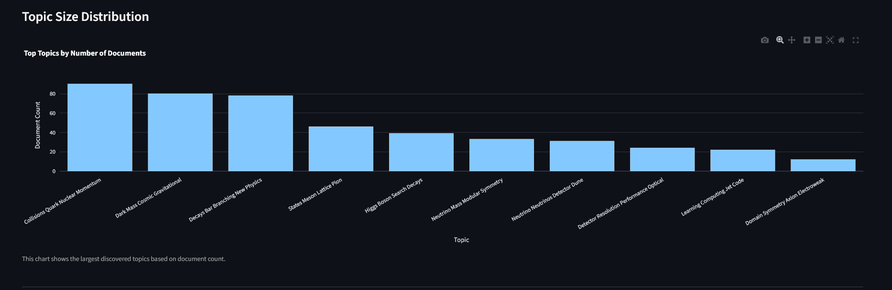
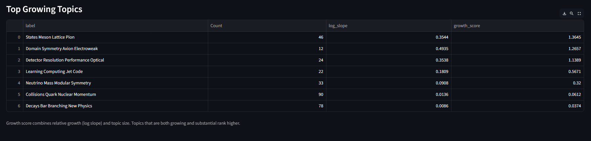
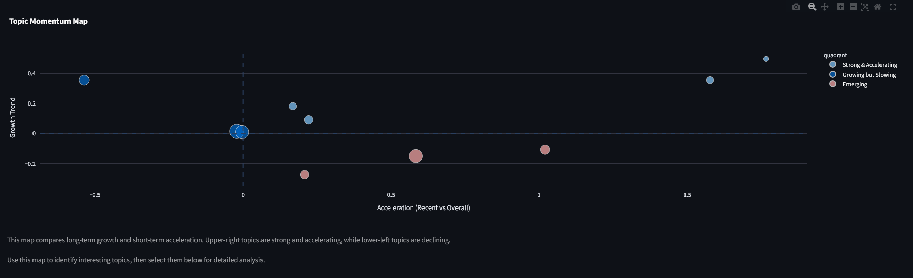
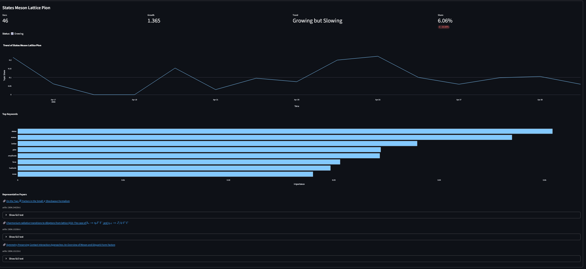

# 🔬 Research Topic Analyzer

Analyze emerging research trends across scientific domains using **topic modeling** and **temporal trend analysis**.

---

## 🚀 Overview

This project builds an end-to-end pipeline to:

* Collect research papers (e.g., arXiv)
* Generate embeddings
* Discover topics using BERTopic
* Track how topics evolve over time
* Identify **emerging**, **growing**, and **declining** research trends

👉 Built as an interactive **Streamlit dashboard** for exploration and analysis.

---

## 🧠 Key Features

### 📊 Topic Discovery

* Automatically extracts topics from research papers
* Uses embeddings + clustering (BERTopic)

### 📈 Trend Analysis

* Topic share over time
* Growth score (log-trend based)
* Emerging vs declining topics

### 🚀 Momentum Map

* Visualizes:

  * Long-term growth
  * Short-term acceleration
* Identifies:

  * 🚀 Rapidly growing topics
  * 📉 Declining topics
  * 🌱 Emerging areas

### 🔍 Topic Explorer

* Compare multiple topics over time
* Interactive line charts

### 🧩 Deep Dive Analysis

For each topic:

* Trend over time
* Growth metrics
* Keyword importance
* Representative papers (clickable)

---

## 🖥️ Demo

### Topic Overview



### Trend Intelligence



### Momentum Map



### Topic Deep Dive



---

## ⚙️ Tech Stack

* Python
* Streamlit
* BERTopic
* UMAP
* scikit-learn
* Plotly
* Pandas / NumPy

---

## 📂 Project Structure

```
.
├── app.py
├── data_collect.py
├── data_clean.py
├── embedding_data.py
├── topic_model.py
├── analysis.py
├── arxiv_categories.json
├── requirements.txt
└── images/
```

---

## ▶️ Run Locally

```bash
pip install -r requirements.txt
streamlit run app.py
```

---

## 📌 Example Use Cases

* Identify trending AI research topics
* Explore emerging areas in physics or ML
* Track topic evolution over time
* Compare research directions across domains

---

## 💡 Future Improvements

* LLM-based topic summaries
* Cross-category topic comparison
* Topic similarity search
* Export & reporting features

---

## 👤 Author

Built as a data science / ML portfolio project.

---

## ⭐ If you like it

Give it a star ⭐ on GitHub!
